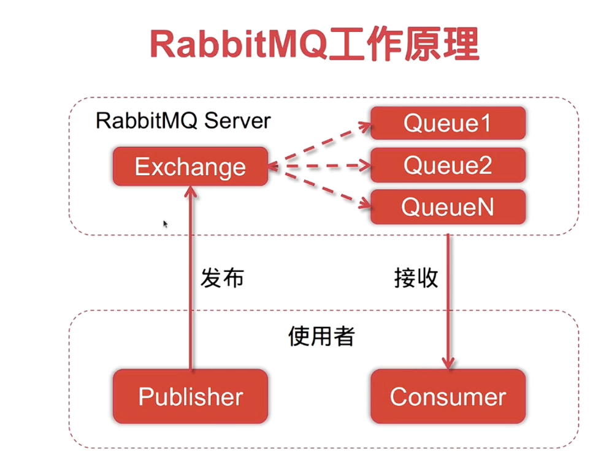
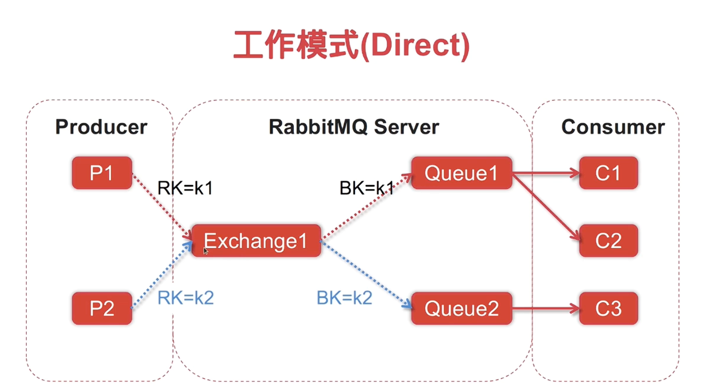
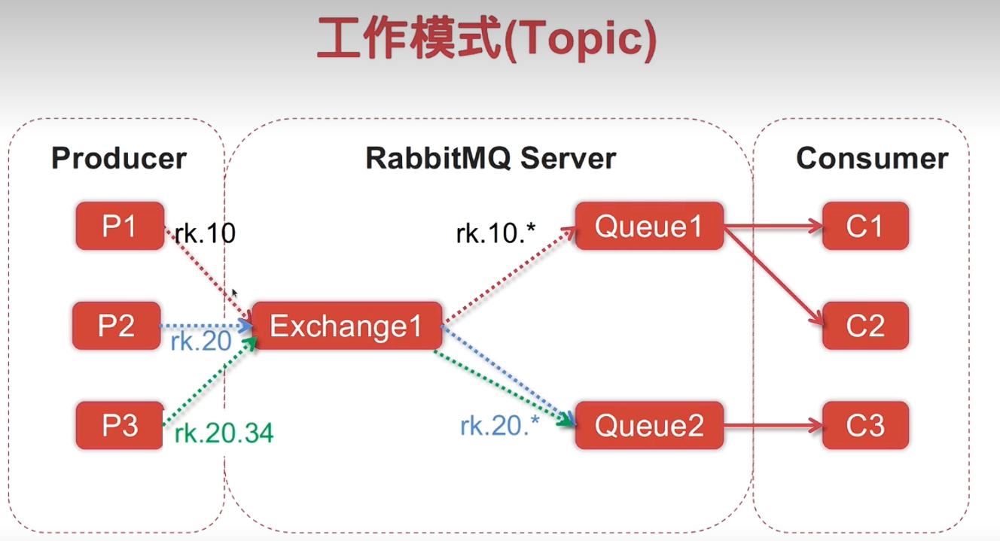

`config/rabbitmq.go`

`mq/consumer.go、define.go、producer.go`


`handler/handler.go`

`service/transfer/main.go`


## RabbitMQ原理：
### RabbitMQ关键术语

1. **Exchange（交换机）**：
    - 用于接收生产者发送的消息并根据绑定规则将消息路由到队列。
    - 常见类型：
      - `direct`：类似单播，根据路由键精确匹配队列。
      - `fanout`：类似广播，将消息广播到所有绑定的队列。
      - `topic`：类似组播，根据路由键模式匹配队列。
      - `headers`：根据消息头属性匹配队列，请求头与消息头匹配才能接收消息

2. **Queue（队列）**：
    - 用于存储消息的缓冲区，消费者从队列中获取消息进行处理。

3. **Routing Key（路由键）**：
    - 消息的路由规则，生产者发送消息时指定，交换机根据路由键将消息分发到对应的队列。

4. **Binding（绑定）**：
    - 连接交换机和队列的关系，定义了路由键或匹配规则。

5. **Producer（生产者）**：
    - 负责发送消息到交换机的应用程序。

6. **Consumer（消费者）**：
    - 从队列中接收并处理消息的应用程序。

7. **Channel（信道）**：
    - RabbitMQ 中的通信通道，生产者和消费者通过信道与 RabbitMQ 服务器交互。

8. **Connection（连接）**：
    - 应用程序与 RabbitMQ 服务器之间的 TCP 连接。

9. **Message（消息）**：
    - 由生产者发送到队列并由消费者处理的数据单元。

10. **Ack（确认）**：
     - 消费者处理消息后向 RabbitMQ 发送的确认信号，确保消息不会丢失。

11. **AMQP（高级消息队列协议）**：
     - RabbitMQ 使用的消息传递协议，提供消息的可靠传输和路由功能。
一种开源的消息代理、面向消息的中间件、遵循AMQP协议的MQ服务，逻辑解耦来解决异步任务。


**Direct：**
RK=k1的消息通过交换机投递到BK=k1的队列中队列中的消息再由提前与该队列绑定的消费者进行消费。，k2同理。

**Topic：**
为每个队列设置一个通配符，通配符为rk.10的消息通通通过交换机路由到队列1，通配符为rk.20开头的队列统统路由到队列2




## 完整过程

安装好rabbitMQ，在上面创建好交换机`Exchange`和队列`Queue`，将队列与交换机进行绑定，并创建队列的`Rountkey`.

发布者发布消息时交换机会根据消息携带的`Rountkey`转发到对应的队列中


### 1.初始化连接rabbitMQ
整个应用启动时，`producer.go`中定义的`func init` 自动检查`config.AsyncTransferEnable`中如果异步转移开启，则初始化`rabbitMQ`连接获取连接对象`conn`并通过连接对象创建`channel`通道用来进行消息通信


### 2.handler.go的`DoUploadHandler`函数内上传文件:

用户从客户端上传文件→

构建文件元信息，将文件写入临时存储→

判断文件上传位置，如果上传到OSS则根据`cfg.AsyncTransferEnable`判断是同步还是异步→

如果是同步则直接使用`oss.Bucket().PutObject`方法上传到OSS→

如果是异步则将`文件元信息`写入rabbitmq的结构体`TransferData`并调用发布者模块中的`mq.Publish`方法将`文件元信息`通过交换机`exchang`根据`routingKey`发布到对应的队列


### 3.开启消费者监听消费队列中的消息
通过`service/transfer/main.go`手动开启消费者消息队列的监听。

通过调用消费者模块中的`StartConsume`方法，根据设置的队列名`qNam`从指定队列中获取消息并通过定义的回调函数`ProcessTransfer`来处理这些消息。

回调函数会根据消息中的结构体来从临时存储获取文件并转移到对应的OSS中。

完成转移之后可以自行决定是否手动关闭消费者监听（建议一直开着）


------------------------


### 定义了一个rabbitmq的结构体，用于充当交换内容的载体

```go
type TransferData struct {
	FileHash      string
	CurLocation   string
	DestLocation  string
	DestStoreType cmn.StoreType
}

```

### RabbitMQ 连接信道初始化
`conn`作为连接对象,`channel`作为信道，`notifyClose`接收异常事件
```go
var conn *amqp.Connection // 	连接对象
var channel *amqp.Channel //     连接通道
var notifyClose chan *amqp.Error //接收异常关闭事件
```
### RabbitMQ 的连接信道初始化
RabbitMQ 的连接信道初始化通过 `initChannel` 函数完成。已经`存在信道或者创建信道成功`则返回`true`，如果`获取RabbitMQ连接对象失败以及创建信道失败`则返回`false`

- `initChannel` 函数负责通过 `amqp.Dial` 获取Rabbitmq的连接对象`conn`，并并通过 `conn.Channel`创建`channel`信道。

 - 初始化成功后，信道会通过 `NotifyClose` 方法监听关闭事件，并且启动一个`goroutine`线程将监听事件通过`notifyClose`将异常关闭事件发送给`msg`并打印出来，之后再次调用`initChannel`尝试重新自动重连


### RabbitMQ 消息发布者

RabbitMQ 消息发布者通过 `Publish` 函数实现。
- `Publish` 函数用于向指定的交换机`exchange`和路由键`routingKey`发布消息`msg []byte`。
- 在发布消息前，会调用 `initChannel` 检查确保信道已初始化。
- 使用 `channel.Publish` 方法发送消息，支持设置消息的 `exchange`、`routingKey` 和消息体内容。发送消息成功返回ture

### RabbitMQ 消息消费者

RabbitMQ 消息消费者通过 `StartConsume` 函数实现。

- `StartConsume` 函数用于从指定的队列 `qName` 中接收消息，并通过回调函数 `callback` 用于处理接收到的消息。返回值为布尔类型，表示消息处理是否成功。
- 消费者会通过 `channel.Consume` 方法订阅队列对消息进行消费，其中设置了消费者名称 `cName`、是否自动应答 `autoAck` 等参数。
- 消息接收后，会启动一个 `goroutine` 循环处理队列中的消息`msgs`，并调用 `callback` 函数处理消息体 `msg.Body`。
- 如果消息处理失败，可以将任务写入错误队列以便后续处理（TODO 部分）。
- 通过`done = make(chan bool)`创建一个布尔类型通道，通过使得主线程上的消费者会阻塞等待 `done` 信号，确保在没有消息时不会退出。知道接收`StopConsume`发送过来`done` 信号才会关闭消费通道停止消费者。
- 当通道关闭之后其`StopConsume`内部的`goroutine线程`也会因为msgs接受的通道关闭导致其关闭。

#### 停止消息消费

- `StopConsume` 函数用于停止监听队列。
- 通过向 `done` 通道发送信号，通知消费者退出消息接收循环。
- 在退出时会关闭信道以释放资源。


### RabbitMQ 异步转移文件逻辑

RabbitMQ 异步转移文件的逻辑通过 `ProcessTransfer` 函数实现，该函数负责处理从消息队列中接收到的文件转移任务。

#### 文件转移逻辑（转移到OSS）

1. **解析消息内容**：
    - 使用 `json.Unmarshal` 将消息队列中的 JSON 数据解析为 `TransferData` 结构体。
    - 如果解析失败，记录错误日志并返回 `false`。

2. **打开源文件**：
    - 使用 `os.Open` 打开文件的当前存储位置 `CurLocation`。
    - 如果文件打开失败，记录错误日志并返回 `false`。

3. **上传文件到目标存储**：
    - 调用 `oss.Bucket().PutObject` 方法，将文件从源位置上传到目标存储位置 `DestLocation`。
    - 如果上传失败，记录错误日志并返回 `false`。

4. **更新文件存储位置**：
    - 调用 `dblayer.UpdateFileLocation` 更新数据库中文件的存储位置为目标位置。
    - 忽略更新操作的返回值。

5. **返回处理结果**：
    - 如果上述步骤均成功，返回 `true`，否则返回 `false`。

#### 消费者启动逻辑

在 `main` 函数中，通过 `mq.StartConsume` 启动 RabbitMQ 消费者，监听转移任务队列并调用 `ProcessTransfer` 处理消息。

- 检查异步转移功能是否启用：
  - 如果未启用，记录日志并退出程序。
- 启动消费者：
  - 监听配置中指定的队列 `config.TransOSSQueueName`。
  - 使用消费者名称 `transfer_oss`。
  - 将 `ProcessTransfer` 作为消费者模块中的回调函数`callback`处理队列中的消息。

