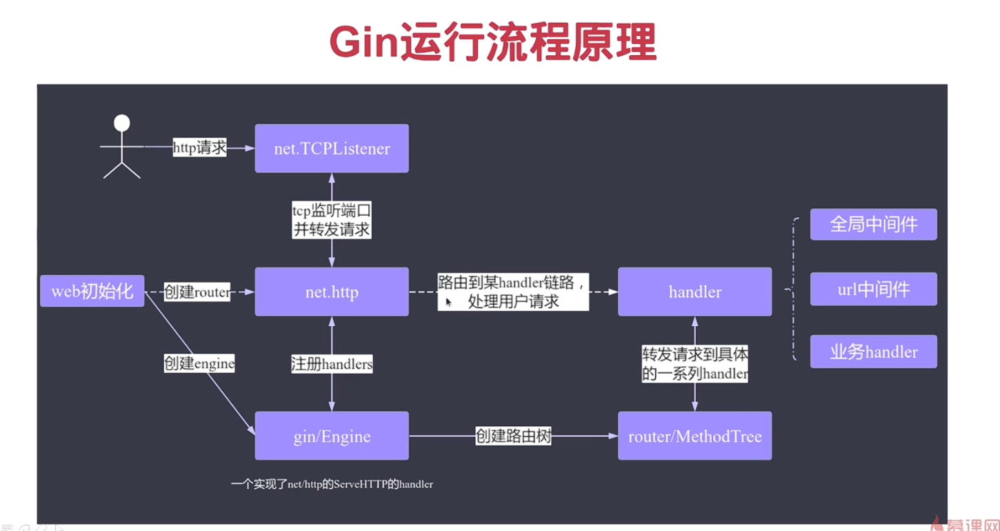

Gin 是一个高性能的 Go 语言 Web 框架，常用于构建 RESTful API。它专注于 HTTP 请求的处理，提供了路由、请求处理、JSON 序列化等功能，非常适合用于构建传统的 Web 应用或 REST API 服务。主要负责与客户端进行HTTP通信

虚线表示未用gin框架时
gin就是在 net/http上面再封装了一层的框架，便于更好的开发

### Gin框架核心概念术语

1. **Router（路由器）**  
    Gin 使用路由器来匹配 HTTP 请求的路径和方法，并将其分发到相应的处理函数。

2. **Context（上下文）**  
    `gin.Context` 是 Gin 中的核心数据结构，用于在中间件和处理函数之间传递请求和响应信息。

3. **Middleware（中间件）**  
    中间件是处理请求的拦截器，可以在请求到达路由之前或响应返回客户端之前执行逻辑。

4. **Handler（处理函数）**  
    处理函数是具体的业务逻辑实现，用于处理特定的 HTTP 请求。

5. **Group（路由分组）**  
    路由分组用于组织和管理具有相同前缀的路由，便于代码结构清晰。

6. **Error Handling（错误处理）**  
    Gin 提供了统一的错误处理机制，可以在上下文中记录和处理错误。

