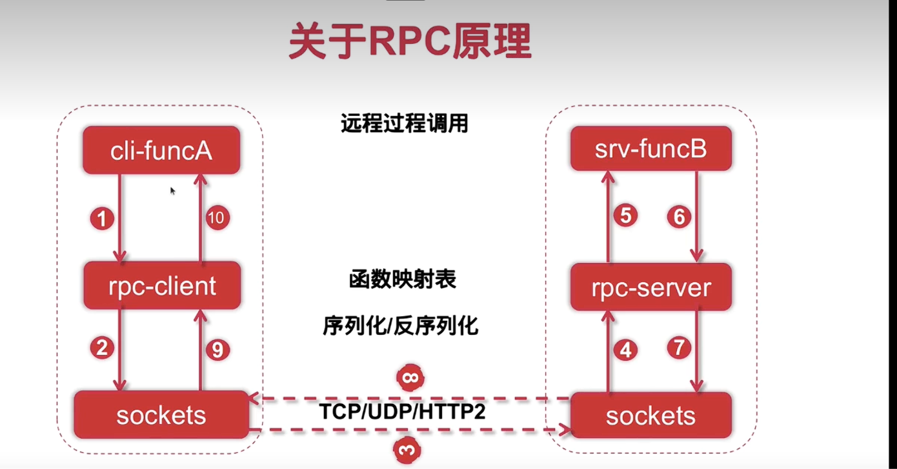
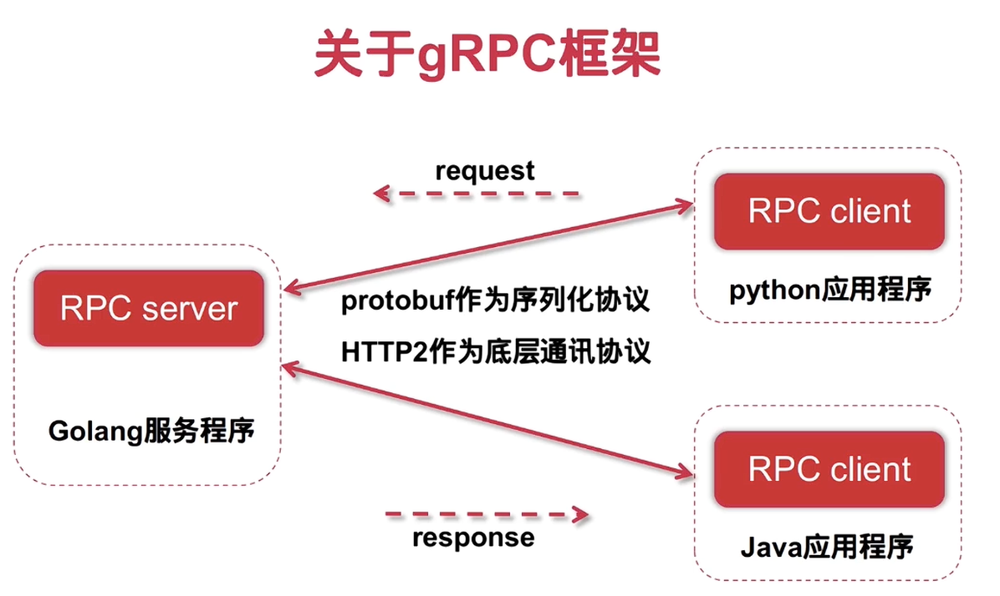
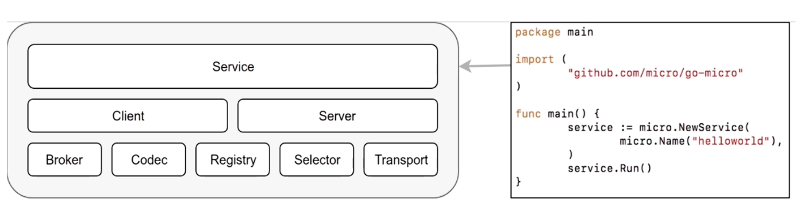

## Gin和gRPC的关系
Gin 主要用于构建 HTTP 服务，Web 层的框架客户端可以通过 HTTP 协议访问这些 后端的RESTful API，而gRPC可以作为后端的底层远程调用通信协议，负责后端微服务之间的高效通信，


------------
## RPC (Remote Procedure Call):

RPC 是一种通信协议，它允许客户端调用远程服务器上的函数或方法，类似于调用本地方法，但实际上是通过网络进行通信。RPC 并不关心具体的网络传输协议，只关注函数调用和参数传输。
RPC 可以使用不同的协议，如 HTTP、TCP 或其他传输协议，来进行服务间的调用。


### 函数之间的远程调用过程：
**1客户端调用函数 (cli-funcA)：**

客户端应用程序（cli-funcA）通过调用本地函数发起 RPC 请求。

**2PC 客户端 (rpc-client)：**

客户端的 RPC 组件将函数调用封装成网络请求，并通过客户端发送该请求。该请求包括需要调用的函数名和相关参数。

**3传输层 (sockets)：**

客户端的 RPC 客户端通过套接字（sockets）发送网络请求，可能使用 TCP、UDP 或 HTTP2 等协议进行传输。

**4RPC 服务器 (rpc-server)：**

服务器端接收到请求后，RPC 服务器解析请求，并根据请求的函数名找到对应的处理函数。

**5服务器端函数执行 (srv-funcB)：**

服务器端的函数 (srv-funcB) 被调用，并处理请求，通常会执行相关的计算或数据操作。

**6函数响应 (rpc-server)：**

服务器函数执行完成后，结果通过 RPC 服务器返回给客户端。

**7返回结果传输 (sockets)：**

结果通过套接字（sockets）返回客户端，使用相同的传输协议。

**8序列化/反序列化 (序列化/反序列化)：**

在客户端和服务器端之间，数据会进行序列化（将对象转化为传输格式）和反序列化（将传输数据恢复为对象）处理。RPC 框架负责自动进行这些操作。

**9客户端接收结果 (rpc-client)：**

客户端的 RPC 客户端接收到服务器返回的响应后，将其转换为客户端可以处理的格式，并返回给原始调用函数。

**10客户端函数返回 (cli-funcA)：**

最终，客户端函数接收到结果并进行后续处理，完成一次 RPC 调用。

-------------

## gRPC(Google Remote Procedure Call):
gRPC 是 是 RPC 的一种实现，它是 Google 开发的一个高性能、开源的远程过程调用（RPC）框架，它基于 HTTP/2 协议和 Protocol Buffers（protobuf）进行序列化。gRPC 支持多语言，适用于微服务架构中不同服务之间的高效通信。


---------------

## Protocol Buffers (protobuf)

Protocol Buffers 是 Google 开发的一种高效、跨平台的序列化数据格式。它是一种语言中立、平台无关的机制，用于定义结构化数据，并将其序列化为紧凑的二进制格式，适合网络传输和存储。

### 特点：
- **高效性**：protobuf 使用二进制格式，比 JSON 或 XML 更小、更快。
- **跨语言支持**：支持多种编程语言，如 C++, Java, Python, Go 等。
- **可扩展性**：支持向后兼容和向前兼容，方便数据结构的演进。
- **自动生成代码**：通过 `.proto` 文件定义数据结构，自动生成序列化和反序列化代码。

### 使用步骤：
1. **定义数据结构**：创建 `.proto` 文件，定义消息类型和字段。
2. **生成代码**：使用 `protoc` 编译器生成目标语言的代码。
3. **集成到项目**：在代码中使用生成的类进行数据序列化和反序列化。

### 应用场景：
- 微服务之间的高效通信。
- 数据存储和传输。
- 配合 gRPC 使用，实现高性能的远程过程调用。

-------------

## go-micro 和 gRPC 的关系

go-micro 是为微服务架构设计的 Go 语言框架，旨在简化微服务的开发和部署。它并不依赖于特定的 RPC 协议，而是提供了一套可扩展的架构来实现服务间的通信，它提供了服务发现、负载均衡、消息编码、RPC 调用等功能。

在 go-micro 中，gRPC 是支持的传输协议之一。实际上，go-micro 提供了插件化的设计，使得它能够支持多种通信协议，包括 gRPC、HTTP、NATS 等。，这里使用了gRPC 作为 go-micro 中的 RPC 实现

### go-micro提供的接口功能：
服务发现：支持服务注册与发现，底层支持etcd/consul/k8s..

负载均衡：rpc服务间的请求调度均衡策略

同步通信：基于RPC通信，支持单向/双向流通信模式

异步通信：提供pub/sub通信模型的接口

高级接口：比如服务发现，提供调用的接口是一致的

 ## gRPC `.proto`、`.pb.go` 和 `.micro.go` 文件之间作用和关系：

---

### 1. **`.proto` 文件**
   - **作用**：
     - 定义服务接口、消息结构和数据类型。
     - 使用 Protocol Buffers（protobuf）语法编写，描述 gRPC 服务的接口和消息格式。
   - **内容**：
     - 服务定义（如 service 和 `rpc` 方法）。
     - 消息定义（如 `message`）。
   - **用途**：
     - 是生成代码的基础文件，通过编译器生成对应语言的代码文件。

---

### 2. **`.pb.go` 文件**
   - **作用**：
     - 是由 `.proto` 文件通过 `protoc` 编译器生成的 Go 语言代码文件。
     - 包含消息结构的定义和序列化/反序列化逻辑。
   - **内容**：
     - 定义了 `.proto` 文件中消息的 Go 结构体。
     - 提供了消息的序列化（`Marshal`）和反序列化（`Unmarshal`）方法。
     - 定义了 gRPC 服务的接口和客户端代码。
   - **生成方式**：
     - 使用 `protoc` 编译器和 Go 插件生成：
       ```bash
       protoc --go_out=. --go-grpc_out=. yourfile.proto
       ```

---

### 3. **`.micro.go` 文件**
   - **作用**：
     - 是基于 `.pb.go` 文件生成的，专门用于 `go-micro` 框架的代码文件。
     - 提供了 `go-micro` 框架特有的服务注册、发现和调用逻辑。
   - **内容**：
     - 包含 `go-micro` 框架的服务接口实现。
     - 提供了服务的注册和调用方法。
   - **生成方式**：
     - 使用 `protoc-gen-micro` 插件生成：
       ```bash
       protoc --micro_out=. --go_out=. yourfile.proto
       ```

---

### 4. **三者的关系**
   - **依赖关系**：
     - `.proto` 是源文件，定义了服务和消息。
     - `.pb.go` 是从 `.proto` 生成的，包含消息的序列化逻辑和 gRPC 服务接口。
     - `.micro.go` 是从 `.proto` 生成的，扩展了 `.pb.go`，适配 `go-micro` 框架。
   - **工作流程**：
     1. 编写 `.proto` 文件。
     2. 使用 `protoc` 编译器生成 `.pb.go` 和 `.micro.go` 文件。
     3. 在代码中使用 `.pb.go` 和 `.micro.go` 提供的接口和方法。

---

### 总结
- **`.proto`**：定义服务和消息，是基础文件。
- **`.pb.go`**：从 `.proto` 生成，包含消息和 gRPC 服务的实现。
- **`.micro.go`**：从 `.proto` 生成，适配 `go-micro` 框架，提供服务注册和调用逻辑。