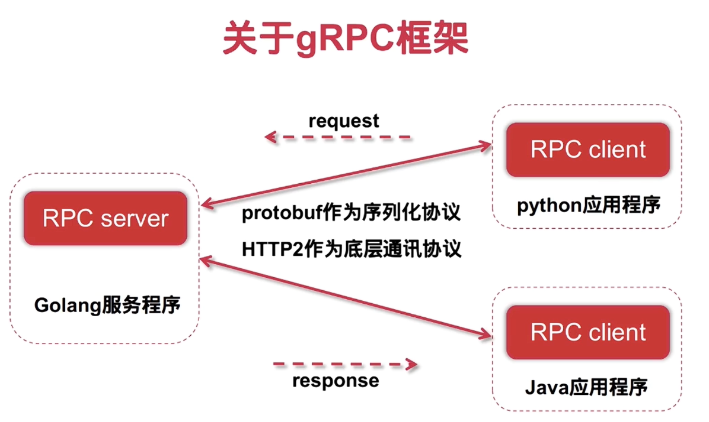

## Gin和gRPC的关系
Gin 主要用于构建 HTTP 服务，Web 层的框架客户端可以通过 HTTP 协议访问这些 后端的RESTful API，而gRPC可以作为后端的底层远程调用通信协议，负责后端微服务之间的高效通信，


------------
## RPC (Remote Procedure Call):

RPC 是一种通信协议，它允许客户端调用远程服务器上的函数或方法，类似于调用本地方法，但实际上是通过网络进行通信。RPC 并不关心具体的网络传输协议，只关注函数调用和参数传输。
RPC 可以使用不同的协议，如 HTTP、TCP 或其他传输协议，来进行服务间的调用。


### 函数之间的远程调用过程：
**1客户端调用函数 (cli-funcA)：**

客户端应用程序（cli-funcA）通过调用本地函数发起 RPC 请求。

**2PC 客户端 (rpc-client)：**

客户端的 RPC 组件将函数调用封装成网络请求，并通过客户端发送该请求。该请求包括需要调用的函数名和相关参数。

**3传输层 (sockets)：**

客户端的 RPC 客户端通过套接字（sockets）发送网络请求，可能使用 TCP、UDP 或 HTTP2 等协议进行传输。

**4RPC 服务器 (rpc-server)：**

服务器端接收到请求后，RPC 服务器解析请求，并根据请求的函数名找到对应的处理函数。

**5服务器端函数执行 (srv-funcB)：**

服务器端的函数 (srv-funcB) 被调用，并处理请求，通常会执行相关的计算或数据操作。

**6函数响应 (rpc-server)：**

服务器函数执行完成后，结果通过 RPC 服务器返回给客户端。

**7返回结果传输 (sockets)：**

结果通过套接字（sockets）返回客户端，使用相同的传输协议。

**8序列化/反序列化 (序列化/反序列化)：**

在客户端和服务器端之间，数据会进行序列化（将对象转化为传输格式）和反序列化（将传输数据恢复为对象）处理。RPC 框架负责自动进行这些操作。

**9客户端接收结果 (rpc-client)：**

客户端的 RPC 客户端接收到服务器返回的响应后，将其转换为客户端可以处理的格式，并返回给原始调用函数。

**10客户端函数返回 (cli-funcA)：**

最终，客户端函数接收到结果并进行后续处理，完成一次 RPC 调用。

-------------

## gRPC(Google Remote Procedure Call):
gRPC 是 是 RPC 的一种实现，它是 Google 开发的一个高性能、开源的远程过程调用（RPC）框架，它基于 HTTP/2 协议和 Protocol Buffers（protobuf）进行序列化。gRPC 支持多语言，适用于微服务架构中不同服务之间的高效通信。


---------------

## Protocol Buffers (protobuf)

Protocol Buffers 是 Google 开发的一种高效、跨平台的序列化数据格式。它是一种语言中立、平台无关的机制，用于定义结构化数据，并将其序列化为紧凑的二进制格式，适合网络传输和存储。

### 特点：
- **高效性**：protobuf 使用二进制格式，比 JSON 或 XML 更小、更快。
- **跨语言支持**：支持多种编程语言，如 C++, Java, Python, Go 等。
- **可扩展性**：支持向后兼容和向前兼容，方便数据结构的演进。
- **自动生成代码**：通过 `.proto` 文件定义数据结构，自动生成序列化和反序列化代码。

### 使用步骤：
1. **定义数据结构**：创建 `.proto` 文件，定义消息类型和字段。
2. **生成代码**：使用 `protoc` 编译器生成目标语言的代码。
3. **集成到项目**：在代码中使用生成的类进行数据序列化和反序列化。

### 应用场景：
- 微服务之间的高效通信。
- 数据存储和传输。
- 配合 gRPC 使用，实现高性能的远程过程调用。

-------------

## go-micro 和 gRPC 的关系

go-micro 是为微服务架构设计的 Go 语言框架，旨在简化微服务的开发和部署。它并不依赖于特定的 RPC 协议，而是提供了一套可扩展的架构来实现服务间的通信，它提供了服务发现、负载均衡、消息编码、RPC 调用等功能。

在 go-micro 中，gRPC 是支持的传输协议之一。实际上，go-micro 提供了插件化的设计，使得它能够支持多种通信协议，包括 gRPC、HTTP、NATS 等。，这里使用了gRPC 作为 go-micro 中的 RPC 实现

### go-micro提供的接口功能：
服务发现：支持服务注册与发现，底层支持etcd/consul/k8s..

负载均衡：rpc服务间的请求调度均衡策略

同步通信：基于RPC通信，支持单向/双向流通信模式

异步通信：提供pub/sub通信模型的接口

高级接口：比如服务发现，提供调用的接口是一致的

## gRPC `.proto`、`.pb.go` 和 `.micro.go` 文件之间作用和关系：

---

### 1. **`.proto` 文件**
   - **作用**：
     - 定义服务接口、消息结构和数据类型。
     - 使用 Protocol Buffers（protobuf）语法编写，描述 gRPC 服务的接口和消息格式。
   - **内容**：
     - 服务定义（如 service 和 `rpc` 方法）。
     - 消息定义（如 `message`）。
   - **用途**：
     - 是生成代码的基础文件，通过编译器生成对应语言的代码文件。

---

### 2. **`.pb.go` 文件**
   - **作用**：
     - 是由 `.proto` 文件通过 `protoc` 编译器生成的 Go 语言代码文件。
     - 包含消息结构的定义和序列化/反序列化逻辑。
   - **内容**：
     - 定义了 `.proto` 文件中消息的 Go 结构体。
     - 提供了消息的序列化（`Marshal`）和反序列化（`Unmarshal`）方法。
     - 定义了 gRPC 服务的接口和客户端代码。
   - **生成方式**：
     - 使用 `protoc` 编译器和 Go 插件生成：
       ```bash
       protoc --go_out=. --go-grpc_out=. yourfile.proto
       ```

---

### 3. **`.micro.go` 文件**
   - **作用**：
     - 是基于 `.pb.go` 文件生成的，专门用于 `go-micro` 框架的代码文件。
     - 提供了 `go-micro` 框架特有的服务注册、发现和调用逻辑。
   - **内容**：
     - 包含 `go-micro` 框架的服务接口实现。
     - 提供了服务的注册和调用方法。
   - **生成方式**：
     - 使用 `protoc-gen-micro` 插件生成：
       ```bash
       protoc --micro_out=. --go_out=. yourfile.proto
       ```

---

### 4. **三者的关系**
   - **依赖关系**：
     - `.proto` 是源文件，定义了服务和消息。
     - `.pb.go` 是从 `.proto` 生成的，包含消息的序列化逻辑和 gRPC 服务接口。
     - `.micro.go` 是从 `.proto` 生成的，扩展了 `.pb.go`，适配 `go-micro` 框架。
   - **工作流程**：
     1. 编写 `.proto` 文件。
     2. 使用 `protoc` 编译器生成 `.pb.go` 和 `.micro.go` 文件。
     3. 在代码中使用 `.pb.go` 和 `.micro.go` 提供的接口和方法。

---

### 总结
- **`.proto`**：定义服务和消息，是基础文件。
- **`.pb.go`**：从 `.proto` 生成，包含消息和 gRPC 服务的实现。
- **`.micro.go`**：从 `.proto` 生成，适配 `go-micro` 框架，提供服务注册和调用逻辑。

## .proto文件内容解析
### user.proto举例
```proto
service UserService {
    // 用户注册
    rpc Signup(ReqSignup) returns (RespSignup) {}
    ...
    ...

}
message ReqSignup {
    string username = 1;
    string password = 2;
}

message RespSignup {
    int32 code = 1;
    string message = 2;
}
```
`service UserService`定义了一个名为 UserService 的 gRPC 服务，包含远程方法（RPC）：

- Signup：处理用户注册请求。

`message`定义了Signup业务代码中请求和响应的结构体类型
- ReqSignup:客户端调用 Signup 方法时发送的数据结构。
- RespSignup：服务端处理完注册请求后返回的数据结构。

**使用proto编译器会将以上内容生成如下内容:**
- .pb.go:根据`message`生成包含消息结构（如 ReqSignup、RespSignup）的 Go 代码
- user_grpc.pb.go：根据`message`和`service UserService`生成包含 gRPC 服务端和客户端的接口定义（如 UserServiceServer、UserServiceClient）以及它们对应的gRPC服务(如Signup）的处理方法。


## pb.go与micro.go详细解析文件内容和执行流程
⭐**这里以`Account微服务`中`Signup`方法举例**
**在Service\account\proto中**
user.pb.micro.go 和 user.pb.go 是由 Protocol Buffers 和 Micro 框架生成的代码文件，它们分别定义了不同的功能，主要用于支持 gRPC 和 Micro 框架的服务调用。以下是两者的功能对比和解释：

---

### 1. user.pb.go 的功能
user.pb.go 是由 `protoc-gen-go` 插件生成的文件，主要用于定义 Protocol Buffers 的消息结构和序列化/反序列化逻辑。

#### 主要功能
##### 消息结构定义：
  
 
Protocol Buffers定义了`Signup`方法中请求和响应消息结构体类型。
这将在正式编写微服务功能`Signup`方法时被使用。
`service\account\handle\user.go`中的`proto.ReqSignup`和`proto.RespSignup`就是在`user.pb.go`中定义的请求和响应消息结构体类型:
```go
 // `service\account\handle\user.go`中
func (u *User) Signup(ctx context.Context, req *proto.ReqSignup, res *proto.RespSignup) error {}
```
----------
**(1).以上的请求响应结构体proto.ReqSignup在user.pb.go中定义如下**：
```go
   type ReqSignup struct {
	state         protoimpl.MessageState
	sizeCache     protoimpl.SizeCache
	unknownFields protoimpl.UnknownFields

	Username string `protobuf:"bytes,1,opt,name=username,proto3" json:"username,omitempty"`
	Password string `protobuf:"bytes,2,opt,name=password,proto3" json:"password,omitempty"`
}
 ```
  `ReqSignup` 是一个请求消息，包含 `Username` 和 `Password` 字段。将在`ReqSignup`功能方法中被使用

 
**(2).以上的请求响应结构体proto.RespSignup在user.pb.go中定义如下**
```go
type RespSignup struct {
	state         protoimpl.MessageState
	sizeCache     protoimpl.SizeCache
	unknownFields protoimpl.UnknownFields

	Code    int32  `protobuf:"varint,1,opt,name=code,proto3" json:"code,omitempty"`
	Message string `protobuf:"bytes,2,opt,name=message,proto3" json:"message,omitempty"`
}
```
`RespSignup` 是一个响应消息，包含 `Code` 和 `Message` 字段。这些字段将在`ReqSignup`功能方法中被使用


--------------
**在定义的结构体RespSignup和ReqSignup之下还实现了由它两个作为接收者的方法**
例如：
**(1). 序列化和反序列化**：
   - 提供了将消息序列化为二进制格式（用于网络传输）和从二进制格式反序列化为消息对象的功能。
   - 例如：
     ```go
     func (x *ReqSignup) ProtoReflect() protoreflect.Message
     ```

**(2). **消息的 Getter 方法**：
   - 为每个字段生成 Getter 方法，用于安全地访问字段值。
   - 例如：
     ```go
     func (x *ReqSignup) GetUsername() string {
         if x != nil {
             return x.Username
         }
         return ""
     }
     ```
1. **消息的元信息**：
   - 包含消息的元信息（如字段编号、类型等），用于支持动态操作。
   - 例如：
     ```go
     func (*ReqSignup) Descriptor() ([]byte, []int)
     ```
**还有很多类似方法 不再赘述。**

#### 适用场景
- user.pb.go 主要用于消息的定义和处理，适合在客户端和服务端之间传递数据。
- 它是 Protocol Buffers 的核心文件，与具体的服务实现无关。

---

### 2. user.pb.micro.go 的功能
user.pb.micro.go 是由 `protoc-gen-micro` 插件生成的文件，基于 Micro 框架扩展了 Protocol Buffers 的功能
**`Server API`:为服务端定义服务接口，服务端处理逻辑（在微服务服务端的处理）**

**`Client API`：为客户端定义服务调用接口以及调用逻辑(该微服务被其它微服务调用的处理)。**

这里以`Account微服务`中`Signup`方法举例，这里**Signup方法在Account微服务中实现**，并**被apigw微服务使用Account的客户端upCli调用**


#### Clint API：服务调用接口和调用逻辑(客户端使用)
##### (1)客户端实例
  定义了Account客户端实例的创建方法，用于初始化Account微服务的客户端
```go
  func NewUserService(name string, c client.Client) UserService {
	if c == nil {
		c = client.NewClient()
	}
	if len(name) == 0 {
		name = "go.micro.service.user"
	}
	return &userService{
		c:    c,
		name: name,
	}
}
```
##### (2). 服务调用接口定义：
 定义了客户端调用的接口（`UserService`），其中描述了的调用逻辑方法。
 例如：

```go
  type UserService interface {
	// 用户注册
	Signup(ctx context.Context, in *ReqSignup, opts ...client.CallOption) (*RespSignup, error)
	 .....
     .....
}

type userService struct {
	c    client.Client
	name string
}
 ```
- `UserService` 是客户端调用接口，包含 `Signup`、`Signin`、`UserInfo` 等方法。

##### （3）客户端调用逻辑方法：
   - 提供了客户端的调用逻辑，用于其它微服务使用该微服务的客户端调用。
   - 例如：
     ```go
     func (c *userService) Signup(ctx context.Context, in *ReqSignup, opts ...client.CallOption) (*RespSignup, error) {
         req := c.c.NewRequest(c.name, "UserService.Signup", in)
         out := new(RespSignup)
         err := c.c.Call(ctx, req, out, opts...)
         if err != nil {
             return nil, err
         }
         return out, nil
     }
     ```
     - `Signup` 方法通过 Micro 框架的客户端调用远程服务。
 
##### （4）在apigw微服务的中如何被使用:
 在`service\apigw\handler`
- 在apigw微服务中通过初始化一个Account的客户端userCli
  `userCli = userProto.NewUserService("go.micro.service.user", service.Client())`
- 在apigw微服务的功能中使用`userCli.Signup`（Signup就是3中客户掉的调用逻辑方法）客户端来调用Account微服务
 ```go
  // DoSignupHandler : 处理注册post请求
func DoSignupHandler(c *gin.Context) {
	username := c.Request.FormValue("username")
	passwd := c.Request.FormValue("password")

	resp, err := userCli.Signup(context.TODO(), &userProto.ReqSignup{
		Username: username,
		Password: passwd,
	})
}
 ```
  
----------------

#### Server API：服务接口，服务端处理逻辑(服务端使用)
##### （1）服务端处理逻辑：
 - 服务端必须实现的接口——即你的“业务代码”要写在这些方法里。
  如：
   ```go
     type UserServiceHandler interface {
         Signup(context.Context, *ReqSignup, *RespSignup) error
         .....
     }
   ```
- 那么在服务端业务代码中必须实现：
    `Service\account\user.go`中
    ```go
    package handler 
    // User : 用于实现UserServiceHandler接口的对象
    type User struct{}

    // Signup : 处理用户注册请求
    func (u *User) Signup(ctx context.Context, req *proto.ReqSignup, res *proto.RespSignup) error {
	username := req.Username
	passwd := req.Password

	// 参数简单校验
	if len(username) < 3 || len(passwd) < 5 {
		res.Code = common.StatusParamInvalid
		res.Message = "注册参数无效"
		return nil
	}

	// 对密码进行加盐及取Sha1值加密
	encPasswd := util.Sha1([]byte(passwd + pwd_salt))
	// 将用户信息注册到用户表中
    ........
    ......
    }
    ```
##### (2)将微服务的业务进行服务注册并对外提供服务
`在Service\account\main.go中`：

会使用RegisterUserSereviceHandler来讲该微服务所有功能注册到服务上`proto.RegisterUserServiceHandler(service.Server(), new(handler.User))`
其中`handler.User`就是业务代码中该微服务所有功能的方法

`RegisterUserServiceHandler`的具体注册逻辑在`user.pb.micro.go`中：
```go
//1
type userServiceHandler struct {
    UserServiceHandler
}
//2
func (h *userServiceHandler) Signup(ctx context.Context, in *ReqSignup, out *RespSignup) error {
	return h.UserServiceHandler.Signup(ctx, in, out)
}
//3
func RegisterUserServiceHandler(s server.Server, hdlr UserServiceHandler, opts ...server.HandlerOption) error {
    type userService interface {
        Signup(ctx context.Context, in *ReqSignup, out *RespSignup) error
        … // 省略其他方法签名
    }
    type UserService struct {
        userService
    }
    h := &userServiceHandler{hdlr}
    return s.Handle(s.NewHandler(&UserService{h}, opts...))
}

```
- `s server.Server`：是 go-micro 提供的服务实例，内含网络监听、服务注册（Consul/Etcd/MDNS）等能力。

- `hdlr UserServiceHandler`：就是你业务代码中该微服务所有功能的方法
  
------

###### **⭐！！！（必看）上述代码疑难解析：**
- 注意，这里由于服务注册中的server.NewHandler(obj)只会识别你传进去的那个 obj 上是否实现了它“知道”的接口-也就是func RegisterUserServiceHandler{}内部声明的接口，所以这里我们在注册时直接把实现了`UserServiceHandler`的`handler.User`传进去直接使用server.NewHandler函数注册会导致框架检测不到任何可以注册的方法。因为`UserServiceHandler`不是这个函数内部的接口。
  
**解决方法**
 我们需要一个在代码外部定义一个结构体作为适配器来桥接，这个结构体既能内嵌外部传进来的 业务接口，又能实现`func RegisterUserServiceHandler{}`内部声明的接口：
- 代码内部定义服务注册知道的接口 `userService interface` 其中声明的方法和外部接口一样
- 在外部定义一个结构体`userServiceHandler`作为适配器，结构体中声明了实际的业务功能接口`UserServiceHandler`这样就内嵌了外部`UserServiceHandler`接口；之后通过以下函数，将userServiceHandler作为接收者实现`userService interface`中声明的所有方法，这样就使得实现了`userService`接口：
    ```go
    func (h *userServiceHandler) Signup(ctx context.Context, in *ReqSignup, out *RespSignup) error {
        return h.UserServiceHandler.Signup(ctx, in, out)
    }
    ```

- 之后在代码内部声明一个结构体`type UserService struct`，它内嵌了内部接口`userService`，由于适配器`userServiceHandler struct`实现了这个内部接口，因此内部接口就可以用来存放外部的适配器结构体`userServiceHandler struct`，这样就形成了连接。


⭐**总结**：
- 最终就是适配器 `userServiceHandler struct`内嵌了外部接口`UserServiceHandler`并实现了内部接口`userService` → 内部结构体 `UserService struct`内嵌了内部接口`userService`因此可以存放适配器 → 最终`s.NewHandler`通过内部结构体最终将业务接口(hdlr)通过注册到服务中心

- 这样一来框架看到的对象是 &UserService{h}，它拥有一组 Signup, Signin… 方法，且这些方法满足它自己声明的 userService 接口。你的业务 仍然只需要实现 UserServiceHandler，完全不用关心什么 userService。

- 让“你写的业务代码” ↔ “框架的反射/路由调用” 之间能毫无缝隙地对接。业务代码与框架彻底解耦你只管实现 UserServiceHandler 接口的方法，业务接口改动后只要重新 protoc-gen-micro，不需要手动改框架 glue 逻辑

- 这里通过注册代码外部声明的`func (h *userServiceHandler) Signup` 当客户端调用时，来回都会先经过适配层的Signup方法然后再通过`return h.UserServiceHandler.Signup(ctx, in, out)`找到实际业务层的Signup方法
-----------------

##### 完整执行流程：
- 客户端 发送 RPC 到 UserService.Signup

- go-micro Server

    1 接收字节流 → 解码成 *ReqSignup

    2 调用 userServiceHandler.Signup(ctx, in, out)

    3 转发到你实现的 userHandler.Signup(ctx, in, out)

    4 业务逻辑跑完后，填充 out → 框架序列化返回


#### 适用场景
- user.pb.micro.go 主要用于服务的定义和调用，适合在基于 Micro 框架的分布式系统中使用。
- 它扩展了 Protocol Buffers 的功能，支持服务端和客户端的逻辑。

---

### 3. 两者的区别

| 特性             | user.pb.go                        | user.pb.micro.go                             |
| ---------------- | --------------------------------- | -------------------------------------------- |
| **生成工具**     | `protoc-gen-go`                   | `protoc-gen-micro`                           |
| **主要功能**     | 定义消息结构和序列化/反序列化逻辑 | 定义服务接口、客户端调用逻辑和服务端处理逻辑 |
| **适用场景**     | 数据传输和消息处理                | 服务调用和分布式系统中的服务注册与调用       |
| **是否依赖框架** | 不依赖任何框架                    | 依赖 Micro 框架                              |
| **服务相关功能** | 不包含服务接口                    | 包含服务接口、客户端和服务端的实现           |

---


