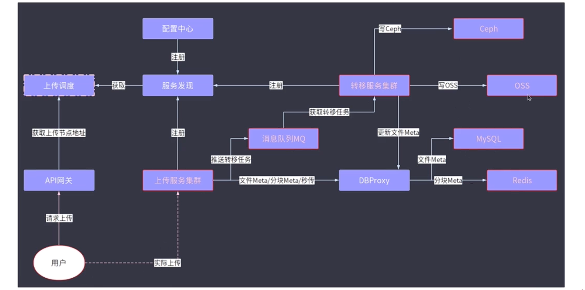
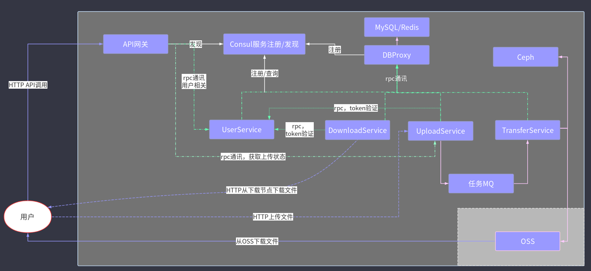

**文件上传**



**整体微服务内部架构**


微服务架构将之前的例如上传，下载，账号管理等功能解耦变成一个独立的服务，该架构由 gRPC、以及go-micro实现,其中gRPC负责各个微服务之间的通信，go-micro为微服务架构设计的 Go 语言框架，旨在简化微服务的开发和部署供了服务发现、负载均衡、消息编码、RPC 调用等功能。go-micro支持gRPC协议。

 **go-micro提供的接口功能：**
服务发现：支持服务注册与发现，底层支持etcd/consul/k8s..

负载均衡：rpc服务间的请求调度均衡策略

同步通信：基于RPC通信，支持单向/双向流通信模式

异步通信：提供pub/sub通信模型的接口

高级接口：比如服务发现，提供调用的接口是一致的


##

----------------------------

这里微服务架构分为了六个模块 分别是account、apigw、dbproxy、upload、download、transfer
## 微服务模块解析

微服务客户端`userCli`，`upCli`，`dlCli`，`dbCli`， 服务器端在每一个微服务的main.go中通过`micro.NewService`方法创建

### 1. Account 服务（图中UserService）
负责用户账号的管理，包括用户注册、登录、权限验证等功能。通过 gRPC 接口与其他服务进行通信，确保用户数据的安全性和一致性。
`通过RPC被其它微服务访问`（API网关），类似handler整合了其中的以下功能:
```go 
func (u *User) UserFiles(ctx context.Context, req *proto.ReqUserFile, res *proto.RespUserFile)

func (u *User) UserFileRename(ctx context.Context, req *proto.ReqUserFileRename, res *proto.RespUserFileRename)

func GenToken(username string)

func (u *User) Signup(ctx context.Context, req *proto.ReqSignup,  res *proto.RespSignup)

func (u *User) Signin(ctx context.Context, req *proto.ReqSignin, res *proto.RespSignin)

func (u *User) UserInfo(ctx context.Context, req *proto.ReqUserInfo, res *proto.RespUserInfo) 
```
### 2. APIGW 服务
API 网关服务，作为客户端与后端微服务之间的中间层负责HTTP和RPC协议之前的转换，负责请求路由、协议转换、负载均衡以及安全认证等功能。
可以`直接通过HTTP访问`，并类似handler整合了其中的以下功能：
```go
// 注册
	router.GET("/user/signup", handler.SignupHandler)
	router.POST("/user/signup", handler.DoSignupHandler)
	// 登录
	router.GET("/user/signin", handler.SigninHandler)
	router.POST("/user/signin", handler.DoSigninHandler)
	// 用户查询
	router.POST("/user/info", handler.UserInfoHandler)

	// 用户文件查询
	router.POST("/file/query", handler.FileQueryHandler)
	// 用户文件修改(重命名)
	router.POST("/file/update", handler.FileMetaUpdateHandler)

```
func init 为`Account`、`Upload`、`Download`三个微服务初始化了三个客户端
`userCli`，`upCli`，`dlCli`（**微服务的服务器在main.go中利用micro.NewService创建**）来从API网关通过RPC协议调用这三个微服务中的功能。
其中`Upload`和`Download`微服务由于只在entry.go定义了RPC入口因此微服务之间的调用只能从`upCli.UploadEntry`和`dlCli.DownloadEntry`动态获取入口地址。
`Account`中功能都是RPC调用因此可以直接通过userCli.直接调用

### 3. DBProxy 服务
数据库代理服务，封装了对数据库的访问逻辑，提供统一的数据操作接口，支持读写分离和数据库连接池管理。并且在其中初始化了自己的`客户端dbCli`来供其它微服务操作调用。
其中只有一个RBC入口`dbCli.ExecuteAction`，在其`orm文件夹`中其中整合了`db文件夹`中所有的`数据库操作功能`，具体查看`DBProxy解析.md`的总结

### 4. Upload 服务
文件上传服务，负责处理用户上传的文件，支持多种存储后端（如本地存储、云存储），并提供文件校验和分片上传功能。
**只在entry.go处利用gRPC和go-micro生成了一个Upload服务的入口供UserService微服务调用验证token**
这里该服务为了防止api网关流量过载仍然使用了gin框架可以客户端`通过HTTP协议直接访问`该模块并并类似handler整合了其中的以下功能：
```go
// 文件上传相关接口
	router.POST("/file/upload", api.DoUploadHandler)
	// 秒传接口
	router.POST("/file/fastupload", api.TryFastUploadHandler)

	// 分块上传接口
	router.POST("/file/mpupload/init", api.InitialMultipartUploadHandler)
	router.POST("/file/mpupload/uppart", api.UploadPartHandler)
	router.POST("/file/mpupload/complete", api.CompleteUploadHandler)
```
### 5. Download 服务
文件下载服务，负责处理用户的文件下载请求，支持断点续传和多线程下载，确保高效的数据传输。
**只在entry.go处利用gRPC和go-micro生成了一个download服务的入口供UserService微服务调用验证token**
与Upload服务同理，可以**直接通过HTTP访问**，并类似handler整合了其中的以下功能：
```go
// 文件下载相关接口
	router.GET("/file/download", api.DownloadHandler)
	router.POST("/file/downloadurl", api.DownloadURLHandler)
```
### 6. Transfer 服务（还未整合成微服务）
文件传输服务，负责文件在不同存储节点之间的迁移和备份，确保数据的高可用性和一致性。


### 7.一键启停所有微服务脚本`start-all.sh` `stop-all.sh`

- start-all.sh：用于批量编译和启动微服务，支持日志记录和服务检查。
- stop-all.sh：用于批量停止微服务，确保服务进程被正确终止。
  
-------------------------
## 流程
### 1.为微服务编写功能函数

在各个微服务中编写其功能函数，可以是gRPC协议，可以是HTTP协议

**gRPC协议**：Account微服务中的某个功能函数`func (u *User) UserFiles(ctx context.Context, req *proto.ReqUserFile, res *proto.RespUserFile)`，这个功能可以直接通过该微服务客户端进行操作`userCli.UserFiles`

**gin框架的HTTP协议**:download的`func DownloadURLHandler(c *gin.Context) `，前端可以直接调用，也可以其微服务客户端设置的唯一gRBC入口`DownloadEntry`访问`dlCli.DownloadEntry`


### 2.在上面的所有微服务中编写proto模块定义gRPC逻辑

- 在`.proto文件`中通过`service servicename{}`定义微服务中的gRBC功能服务接口
 通过`message`定义RBC服务接口接收和返回的的消息结构和数据类型

- 生成`.pb.go`:通过protoc编译器利用`.proto文件`生成Go语言代码文件`.pb.go`,它包含了包含消息的序列化/反序列化逻辑和gRPC服务接口。

- 生成`.micro.go`：通过protoc编译器利用`.proto文件`生成生成用于 `go-micro` 框架的代码文件，扩展了 `.pb.go`，适配 `go-micro` 框架。提供了服务注册、发现和调用逻辑。


### 3.为除了Api网关的各个微服务初始化其客户端

四个客户端：`userCli`，`upCli`，`dlCli`在Api网关服务中被初始化,`dbCli`在DBProxy中被初始化。


### 4.在终端利用脚本`start-all.sh`一键注册所有微服务
- 脚本文件内`--registry=consul --registry_address=192.168.0.105:8500`指定了服务注册使用的组件为consul以及consul服务器的地址。（不使用脚本 使用命令行也直接类似这样用命令指定）

`--registry=consul --registry_address=192.168.0.105:8500`这一串命令实际上是微服务的go-micro 框架在运行时自动解析并生效的，具体来说在每个微服务的main.go中在调用
```go
service := micro.NewService(...)
service.Init()
```
的时候，`Init()` 方法内部自动解析命令行参数并将它们注入到对应的注册中心中，这里是consul。
之后部署至于k8s上时就为`--registry=kubernetes`

`Init()` 方法展示了插件（如 Consul 注册中心）是如何被加载和初始化的机制。
它首先处理传入的配置选项（如通过 `micro.Name(...)` 设置的参数），然后执行一次性的初始化逻辑：
包括根据环境变量 MICRO_PLUGIN 动态加载插件，并执行它们的初始化函数。
随后，调用 `cmd.Init() `来解析命令行参数（如 `--registry=consul` 或 `--registry=kubernetes`），并根据插件名称从注册表中找到对应的插件工厂方法，将最终解析出来的插件（如 Consul 注册中心）注入到 s.opts.Registry 中，供服务使用。


go-micro 使用 “插件式注册中心”机制，默认支持多种注册中心包括：consul，etcd，zookeeper，kubernetes

#### 🔗 micro + Consul 的组合
使用方式：
你导入插件 `github.com/micro/go-plugins/registry/consul`

启动服务时加上参数或在代码中指定 --registry=consul

micro 使用 HTTP API 与 Consul 通信，进行服务注册和发现

#### 🔗 micro + Kubernetes 的组合
使用方式：
你导入插件 github.com/micro/go-plugins/registry/kubernetes

启动服务时加上参数或在代码中指定 --registry=kubernetes

micro 内部使用 Kubernetes API 注册服务为 Endpoints 或 CustomResource
- 脚本内实际上执行了所有微服务模块下的`main.go`文件来启动微服务，文件中使用`micro.NewService`创建了一个微服务`（包括微服务的服务器实例）`，并通过`proto.RegisterUserServiceHandler`将服务处理器（功能函数） `new(xxxx.xxxx)` 注册到微服务服务器实例 `service.Server` 中，使该微服务其能够处理 RPC 请求

### 5.用户操作前端页面发出API请求

**1.API请求通过API网关服务**：
- 用户通过前端或客户端发起HTTP请求，API网关作为入口接收请求。
- API网关负责请求的路由、协议转换（HTTP到gRPC）以及安全认证。

**2.根据请求类型利用服务发现（如Consul）找到对应微服务：**
- API网关通过服务发现（如Consul）找到目标微服务的地址。
- API网关使用微服务的客户端（如userCli、upCli、dlCli等）将请求通过gRPC协议路由到目标微服务。

**3.微服务处理请求并返回结果：**
- 目标微服务根据请求调用其功能函数（如UserFiles、UploadEntry等）进行处理。
- 处理完成后，结果通过gRPC协议返回给API网关。

**4.API网关将结果转为HTTP响应返回给用户前端：**
- API网关接收到微服务返回的结果后，将其转换为HTTP响应格式。
- 最终将结果返回给用户前端。

---
**补充说明**：
直接HTTP访问的情况： 某些微服务（如Upload和Download）支持直接通过HTTP访问（如DownloadURLHandler），这时API网关可能不参与请求的处理。


-------------------

 ## gRPC `.proto`、`.pb.go` 和 `.micro.go` 文件之间作用和关系：

---

### 1. **`.proto` 文件**
   - **作用**：
     - 定义服务接口、消息结构和数据类型。
     - 使用 Protocol Buffers（protobuf）语法编写，描述 gRPC 服务的接口和消息格式。
   - **内容**：
     - 服务定义（如 service 和 `rpc` 方法）。
     - 消息定义（如 `message`）。
   - **用途**：
     - 是生成代码的基础文件，通过编译器生成对应语言的代码文件。

---

### 2. **`.pb.go` 文件**
   - **作用**：
     - 是由 `.proto` 文件通过 `protoc` 编译器生成的 Go 语言代码文件。
     - 包含消息结构的定义和序列化/反序列化逻辑。
   - **内容**：
     - 定义了 `.proto` 文件中消息的 Go 结构体。
     - 提供了消息的序列化（`Marshal`）和反序列化（`Unmarshal`）方法。
     - 定义了 gRPC 服务的接口和客户端代码。
   - **生成方式**：
     - 使用 `protoc` 编译器和 Go 插件生成：
       ```bash
       protoc --go_out=. --go-grpc_out=. yourfile.proto
       ```

---

### 3. **`.micro.go` 文件**
   - **作用**：
     - 是基于 `.pb.go` 文件生成的，专门用于 `go-micro` 框架的代码文件。
     - 提供了 `go-micro` 框架特有的服务注册、发现和调用逻辑。
   - **内容**：
     - 包含 `go-micro` 框架的服务接口实现。
     - 提供了服务的注册和调用方法。
   - **生成方式**：
     - 使用 `protoc-gen-micro` 插件生成：
       ```bash
       protoc --micro_out=. --go_out=. yourfile.proto
       ```

---

### 4. **三者的关系**
   - **依赖关系**：
     - `.proto` 是源文件，定义了服务和消息。
     - `.pb.go` 是从 `.proto` 生成的，包含消息的序列化逻辑和 gRPC 服务接口。
     - `.micro.go` 是从 `.proto` 生成的，扩展了 `.pb.go`，适配 `go-micro` 框架。
   - **工作流程**：
     1. 编写 `.proto` 文件。
     2. 使用 `protoc` 编译器生成 `.pb.go` 和 `.micro.go` 文件。
     3. 在代码中使用 `.pb.go` 和 `.micro.go` 提供的接口和方法。

---

### 总结
- **`.proto`**：定义服务和消息，是基础文件。
- **`.pb.go`**：从 `.proto` 生成，包含消息和 gRPC 服务的实现。
- **`.micro.go`**：从 `.proto` 生成，适配 `go-micro` 框架，提供服务注册和调用逻辑。