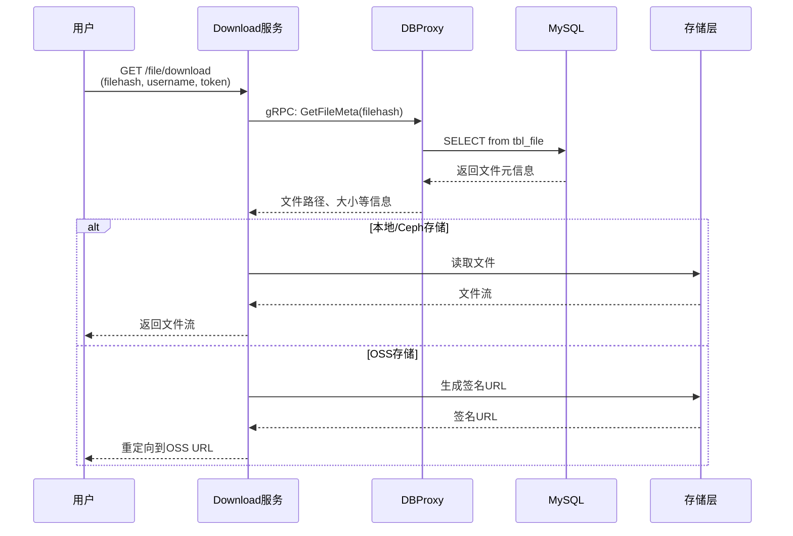

# 文件存储系统 - 整体架构图

## 1. 系统架构总览

---

## 2. 用户登录流程

---

## 3. 文件上传流程

---

## 4. 文件下载流程

---

## 5. 微服务交互关系图

---

## 6. 技术栈架构

---

## 7. Kubernetes部署架构

---

## 8. 核心模块说明

| 模块 | 端口 | 协议 | 职责 |
|------|------|------|------|
| **API网关** | 8080 | HTTP | 统一入口、协议转换、路由分发 |
| **Account** | 8080 | gRPC | 用户注册/登录/Token管理 |
| **Upload** | 28080 | HTTP | 文件上传、秒传、分块上传 |
| **Download** | 38080 | HTTP | 文件下载、断点续传 |
| **DBProxy** | - | gRPC | 数据库操作统一代理 |
| **Transfer** | - | - | 文件迁移/备份（未完成） |

---

## 9. 关键特性

### ✅ 已实现
- 微服务架构（6个服务模块）
- gRPC服务间通信
- Kubernetes容器编排
- 多存储后端支持（本地/OSS/Ceph）
- 分块上传（Redis缓存）
- 异步上传（RabbitMQ）
- 基础RBAC权限控制

### ⚠️ 待完善
- Token验证逻辑未实现
- 服务间认证缺失
- Network Policy未配置
- 服务网格未引入
- Transfer服务未完成

---

## 10. 架构优势

1. **高可扩展性** - 微服务独立部署，可按需扩容
2. **高可用性** - Kubernetes自动故障恢复
3. **存储灵活** - 支持多种存储后端
4. **性能优化** - Redis缓存 + RabbitMQ异步处理
5. **协议适配** - API网关统一HTTP/gRPC转换

---

## 11. 架构演进建议

**当前阶段**: 基础微服务架构 ✅

**下一阶段**: 
- 完善认证鉴权（JWT + Service Token）
- 添加Network Policy
- 引入服务网格（Istio）
- 实现可观测性（日志/监控/追踪）
